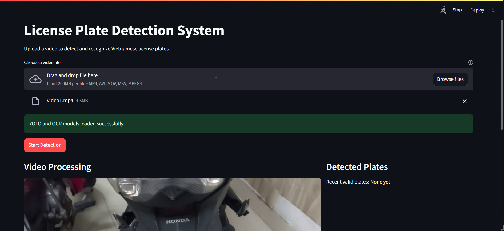
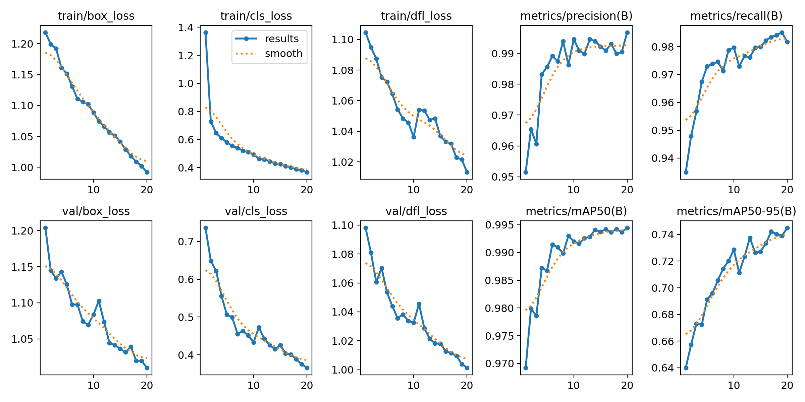
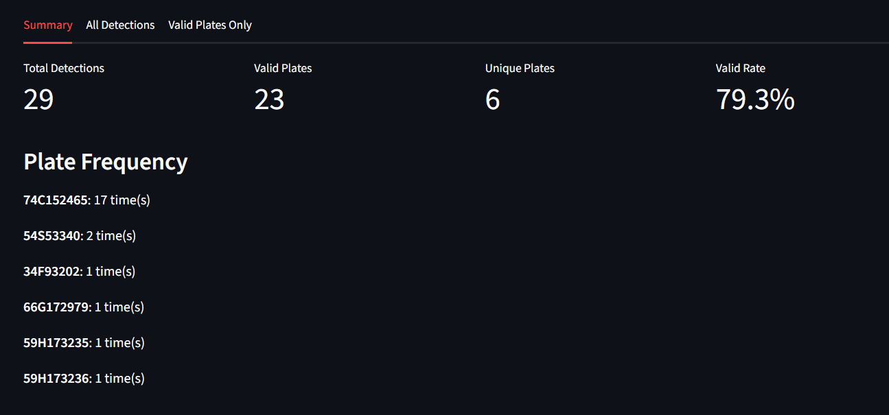
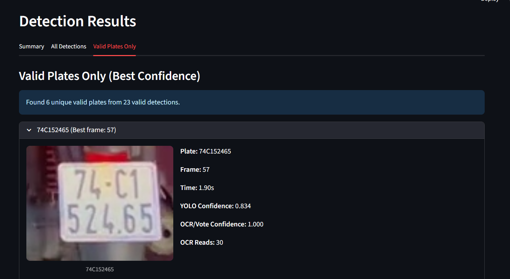

# Vietnamese License Plate Detection & Recognition

<div align="center">

[](https://www.python.org/)
[](https://github.com/ultralytics/ultralytics)
[](https://streamlit.io/)
[](https://github.com/ankandrew/fast-plate-ocr)
[](LICENSE)

**An end-to-end system for detecting and recognizing Vietnamese license plates from video streams, combining YOLO11 object detection, ByteTrack multi-object tracking, and a fine-tuned Compact Convolutional Transformer (CCT) OCR model.**

[📋 Overview](#overview) · [🗃️ Data Collection](#data-collection) · [📦 Dataset](#dataset) · [🧠 Models](#models) · [🚀 Quick Start](#quick-start) · [📊 Results](#results) · [🗂️ Project Structure](#project-structure)




</div>

---

## Overview

This project builds a real-time Vietnamese license plate recognition pipeline operating on video input. The system:

1. **Collects** raw video frames from live RTSP camera streams and public sources.
2. **Preprocesses** frames via noise reduction, brightness/contrast normalization, and ROI cropping.
3. **Detects** license plate bounding boxes using a fine-tuned **YOLO11n** model.
4. **Tracks** plates across frames with **ByteTrack** to build temporally stable read buffers.
5. **Recognizes** plate characters via a fine-tuned **CCT-based OCR** model (Fast Plate OCR).
6. **Post-processes** results with per-character voting, regex format validation, and deduplication.
7. **Displays** annotated video frames and a structured result table via a **Streamlit** web app.

---

## Data Collection

### Camera Stream Crawling (RTSP)

Raw training footage was collected directly from live traffic camera streams using **FFmpeg** over RTSP. Streams were segmented into 10-minute clips with automatic timestamped filenames:

```bash
ffmpeg -rtsp_transport tcp -rtsp_flags prefer_tcp \
  -i "rtsp://<camera-host>/streaming?channel=01&subtype=0" \
  -c:v copy -an -f segment -segment_time 600 \
  -reset_timestamps 1 -strftime 1 \
  "C:\Users\...\datacrawl\cam_%Y%m%d_%H%M%S.mp4"
```

A post-processing script then extracted license plate crops from each segment, naming each saved image after its detected plate text for easy annotation:

```
Processing: cam_20250922_181102.mp4
  Saved: 65A32807.jpg
  Saved: 65A11824.jpg
  Saved: 71A06206.jpg
  Saved: 65A48979.jpg
  Saved: 65A37428.jpg

Processing: cam_20250922_181122.mp4
  Saved: 64A06833.jpg

Processing: cam_20250922_181200.mp4
  Saved: 65A42177.jpg
  Saved: 72G193457.jpg
  ...
```

### Detection Dataset Characteristics

| Property | Detail |
|----------|--------|
| **Scene types** | Cars and motorbikes in outdoor daylight conditions |
| **Lighting** | Predominantly daytime; limited low-light/night samples |
| **Plate aspect ratio** | Mainly **3:1 – 4:1** (standard single-row Vietnamese plates) |
| **Training input size** | Resized to **640×640** for YOLO training |

### OCR Dataset Characteristics

| Property | Detail |
|----------|--------|
| **Plate text length** | **6 – 8 characters** (Vietnamese standard format) |
| **Character set** | Digits `0–9`, uppercase letters `A–Z`, padding `_` |
| **Input size to model** | `64×128` px (H×W, RGB) |

#### Common OCR Confusion Pairs

Due to visual similarity under motion blur, low contrast, or oblique viewing angles, the model can confuse the following character pairs:

| Pair | Reason |
|------|--------|
| `"B"` ↔ `"8"` | Similar closed-loop strokes |
| `"O"` ↔ `"0"` | Near-identical oval shape |
| `"0"` ↔ `"6"` | Shared round top, differ only at the bottom |
| `"1"` ↔ `"7"` | Similar vertical stroke with slight top serif |

The fine-tuning process specifically targets these ambiguities through augmented training samples that emphasize these edge cases under challenging imaging conditions.

---

## Dataset

### Detection Dataset — YOLO Format

```text
Data/
├── images/
│   ├── train/
│   ├── val/
│   └── test/
├── labels/
│   ├── train/
│   ├── val/
│   └── test/
└── dataset.yaml
```

Each image has a corresponding `.txt` label file containing bounding boxes for the `license_plate` class in YOLO normalized format.

### OCR Dataset

```text
OCR_LicensePlate_Dataset/
├── train/
│   ├── images/
│   └── train_annotations.csv
├── valid/
│   ├── images/
│   └── valid_annotations.csv
└── test/
    ├── images/
    └── test_annotations.csv
```

**Split summary — 3,763 images total:**

| Split | Count | Ratio |
|-------|------:|------:|
| Train | 2,993 | 79.54% |
| Validation | 381 | 10.12% |
| Test | 389 | 10.34% |

Data cleaning removed blurry images, occluded plates, and unreadable samples. Augmentation pipeline applied during training:

- Brightness & Contrast Adjustment
- Motion Blur
- Coarse Dropout
- Horizontal Flip
- ShiftScaleRotate
- ISONoise
- ColorJitter
- ToGray

---

## Models

### Detection — YOLO11n

| Component | Detail |
|-----------|--------|
| **Architecture** | YOLO11n (nano variant) |
| **Parameters** | ~2.59M |
| **Input size** | 640×640 |
| **Classes** | 1 (`license_plate`) |
| **Training epochs** | 20 |
| **Tracking** | ByteTrack (`bytetrack.yaml`) |
| **Model file** | `DetectLisence_YOLO11.pt` |

**Architecture:**
- **Backbone** — Multi-scale feature extraction via convolution blocks, C3, and SPPF.
- **Neck / FPN** — Feature Pyramid Network fusing multi-scale features for plates of varying sizes.
- **Head / Detect** — Generates bounding boxes, confidence scores, and class labels.

In the app, ByteTrack assigns stable `track_id`s across frames, enabling OCR voting over multiple reads of the same physical plate:

```python
# Primary: tracking mode
results = model.track(frame, persist=True, tracker="bytetrack.yaml", conf=0.35)

# Fallback: single-frame inference
results = model(frame, conf=0.35)
```

#### YOLO11n Fine-tuning Results (20 Epochs)

| Epoch | Train Box Loss | Train Cls Loss | Train DFL Loss | Precision | Recall | mAP@50 | mAP@50-95 |
|------:|---------------:|---------------:|---------------:|----------:|-------:|-------:|----------:|
| 1  | 1.2184 | 1.3638 | 1.1046 | 0.9515 | 0.9349 | 0.9692 | 0.6401 |
| 2  | 1.1992 | 0.7273 | 1.0950 | 0.9654 | 0.9479 | 0.9799 | 0.6573 |
| 3  | 1.1919 | 0.6461 | 1.0874 | 0.9607 | 0.9568 | 0.9786 | 0.6732 |
| 4  | 1.1612 | 0.6105 | 1.0752 | 0.9832 | 0.9675 | 0.9872 | 0.6724 |
| 5  | 1.1517 | 0.5803 | 1.0723 | 0.9856 | 0.9729 | 0.9867 | 0.6912 |
| 6  | 1.1310 | 0.5545 | 1.0644 | 0.9892 | 0.9739 | 0.9914 | 0.6960 |
| 7  | 1.1109 | 0.5397 | 1.0543 | 0.9874 | 0.9746 | 0.9910 | 0.7056 |
| 8  | 1.1058 | 0.5206 | 1.0484 | 0.9939 | 0.9713 | 0.9898 | 0.7143 |
| 9  | 1.1021 | 0.5093 | 1.0457 | 0.9863 | 0.9787 | 0.9930 | 0.7201 |
| 10 | 1.0888 | 0.4942 | 1.0362 | 0.9946 | 0.9797 | 0.9920 | 0.7286 |
| 11 | 1.0744 | 0.4635 | 1.0540 | 0.9910 | 0.9729 | 0.9916 | 0.7113 |
| 12 | 1.0661 | 0.4581 | 1.0535 | 0.9898 | 0.9766 | 0.9926 | 0.7234 |
| 13 | 1.0565 | 0.4444 | 1.0474 | 0.9946 | 0.9762 | 0.9928 | 0.7375 |
| 14 | 1.0511 | 0.4292 | 1.0484 | 0.9940 | 0.9796 | 0.9941 | 0.7263 |
| 15 | 1.0413 | 0.4242 | 1.0369 | 0.9922 | 0.9799 | 0.9937 | 0.7273 |
| 16 | 1.0291 | 0.4104 | 1.0333 | 0.9909 | 0.9823 | 0.9942 | 0.7333 |
| 17 | 1.0183 | 0.4008 | 1.0319 | 0.9931 | 0.9834 | 0.9936 | 0.7421 |
| 18 | 1.0089 | 0.3880 | 1.0228 | 0.9899 | 0.9841 | 0.9942 | 0.7402 |
| 19 | 1.0020 | 0.3804 | 1.0216 | 0.9905 | 0.9851 | 0.9937 | 0.7389 |
| **20** | **0.9919** | **0.3666** | **1.0132** | **0.9968** | **0.9817** | **0.9945** | **0.7450** |

> **Best epoch (epoch 20):** mAP@50 = **0.9945** · mAP@50-95 = **0.7450** · Precision = **0.9968** · Recall = **0.9817**




---

### Recognition — Compact Convolutional Transformer (CCT)

| Component | Detail |
|-----------|--------|
| **Architecture** | CCT (CNN + Transformer encoder + CTC decoder) |
| **Model file** | `cct_s_v1_vn.onnx` |
| **Config file** | `cct_s_v1_vn_plate_config.yaml` |
| **Input size** | 64×128 (H×W, RGB) |
| **Max plate slots** | 9 characters |
| **Alphabet** | `0–9`, `A–Z`, padding `_` |
| **Inference device** | CUDA (if available) or CPU |

**Architecture components:**
- **CNN layers** — Extract local features: strokes, edges, and character shapes.
- **Transformer encoder** — Models global horizontal context across the full plate string.
- **Positional embedding** — Preserves character spatial order.
- **CTC classifier** — Decodes character sequences without manual segmentation.
- **CTC decoder** — Collapses blank `_` tokens and repeated characters into the final plate string.

#### Model Files Explained

The OCR stage relies on **two paired files** that must always be used together:

##### `cct_s_v1_vn.onnx` — ONNX Model Weights

[ONNX (Open Neural Network Exchange)](https://onnx.ai/) is a vendor-neutral format that serializes the trained CCT model's computational graph and weights into a single portable file.

| Property | Detail |
|----------|--------|
| **Format** | ONNX opset 17 |
| **Size** | ~7.5 MB |
| **Runtime** | `onnxruntime` (CPU) or `onnxruntime-gpu` (CUDA) |
| **Input tensor** | `float32 [B, 3, 64, 128]` — batch × RGB channels × H × W |
| **Output tensor** | `float32 [B, 9, 37]` — 9 plate slots × 37 class logits |

Using ONNX decouples inference from the original PyTorch training framework, enabling faster, dependency-light deployment across platforms.

##### `cct_s_v1_vn_plate_config.yaml` — Model Configuration

This YAML file tells the `fast-plate-ocr` runtime exactly how to pre-process input images and post-process model output to match what the ONNX model expects.

```yaml
max_plate_slots: 9        # Number of character output heads
alphabet: '0123456789ABCDEFGHIJKLMNOPQRSTUVWXYZ_'  # 37 classes (36 chars + pad)
pad_char: '_'             # Padding token for plates shorter than 9 chars
img_height: 64            # Resize all plate crops to this height
img_width: 128            # Resize all plate crops to this width
keep_aspect_ratio: false  # Stretch to exact size (no letterbox)
interpolation: linear     # Resize interpolation method
image_color_mode: rgb     # 3-channel RGB input (matches ONNX tensor)
```

**How the two files connect:**

```
Plate crop (any size)
        │
        ▼  [yaml: img_height=64, img_width=128, interpolation=linear, image_color_mode=rgb]
Resize → float32 tensor [B, 3, 64, 128]
        │
        ▼  [onnx: forward pass through CCT]
Logits tensor [B, 9, 37]
        │
        ▼  [yaml: alphabet, pad_char, max_plate_slots]
Argmax per slot → character lookup → strip '_' padding → plate string
```

**Fine-tuning results:**

| Metric | Base Model | Fine-tuned |
|--------|----------:|----------:|
| Character Accuracy | 0.8794 | **0.9899** |
| Plate Accuracy | 0.6752 | **0.9890** |
| Loss | 1.8977 | **0.0205** |
| Plate Length Accuracy | 0.9778 | **1.0000** |
| Top-3 @ K Accuracy | 0.9118 | **1.0000** |

---

## Pipeline

The full inference pipeline is implemented in [`appStreamlit.py`](appStreamlit.py):

```
Video Upload
    │
    ▼
OpenCV Frame Reader  ── processes every 5th frame (skip_frames = 5)
    │
    ▼
YOLO11n Detection + ByteTrack Tracking
    │
    ▼
Padded Crop  ── ±10% bounding box expansion
    │
    ▼
OCR Preprocessing
  · Skip crops < 20px height or < 60px width
  · Upscale small crops via INTER_CUBIC
  · Grayscale → CLAHE (clipLimit=2.0, tileGridSize=4×4)
  · BGR → fastNlMeansDenoisingColored
    │
    ▼
Fast Plate OCR (CCT-VN ONNX)
    │
    ▼
Per-track OCR Voting
  · Accumulate N reads per track_id
  · Vote character-by-character, weighted by per-char confidence
    │
    ▼
Post-processing & Validation
  · Uppercase, strip spaces / dashes / underscores
  · Regex validation:
      ^[0-9]{2}[A-Z]{1,2}[0-9]{4,6}$
      ^[0-9]{2}[A-Z][0-9]{1,2}[0-9]{4,5}$
  · Merge duplicates — keep highest OCR confidence
    │
    ▼
Streamlit Result Display
```

---

## Quick Start

### Prerequisites

```bash
pip install streamlit ultralytics opencv-python fast-plate-ocr onnxruntime
```

For GPU-accelerated OCR inference:

```bash
pip install onnxruntime-gpu
```

### Running the App

```bash
streamlit run appStreamlit.py
```

Open your browser at `http://localhost:8501`, upload a video file (`.mp4`, `.avi`, `.mov`, `.mkv`), and click **Start Detection**.

---

## Results

### YOLO11n Detection — Training Summary

Model trained for **20 epochs** on the Vietnamese license plate detection dataset. Key metrics at final epoch:

| Metric | Value |
|--------|------:|
| **mAP@50** | **0.9945** |
| **mAP@50-95** | **0.7450** |
| **Precision** | **0.9968** |
| **Recall** | **0.9817** |
| **Val Box Loss** | 1.0102 |
| **Val Cls Loss** | 0.3658 |
| **Val DFL Loss** | 1.0014 |

> Losses converged steadily across all 20 epochs. Classification loss dropped from **1.364 → 0.367** and box loss from **1.218 → 0.992**, confirming stable learning without overfitting.

### App Output

The Streamlit app provides:

| Output | Description |
|--------|-------------|
| **Annotated Video** | Frame-by-frame bounding boxes with plate text and confidence |
| **Total Detections** | Count of all plate detections across the video |
| **Valid Plates** | Count of detections passing Vietnamese format validation |
| **Unique Plates** | Deduplicated valid plates (best confidence kept) |
| **Valid Rate** | Percentage of detections matching the plate format regex |
| **Per-detection detail** | Crop image · frame · timestamp · YOLO conf · OCR/vote conf · read count |

<video src="images/demo.mp4" controls width="100%"></video>

<table>
  <tr>
    <td></td>
    <td></td>
  </tr>
</table>


---

## Project Structure

```text
Detect_Plate/
├── appStreamlit.py                  # Streamlit demo application
├── DetectLisence_YOLO11.pt          # YOLO11n license plate detection model
├── cct_s_v1_vn.onnx                 # CCT OCR model (ONNX format)
├── cct_s_v1_vn_plate_config.yaml    # OCR model configuration
├── Report.pdf                       # Full project report
├── images/                          # Media assets for README
│   ├── demo_banner.gif              #   → GIF/video demo tổng quan
│   ├── crawl_examples.jpg           #   → Ảnh ví dụ frame crawl / crop biển số
│   ├── training_curves.png          #   → Biểu đồ loss & mAP theo epoch
│   ├── pipeline_diagram.png         #   → Sơ đồ pipeline inference
│   └── app_screenshot.png           #   → Ảnh chụp giao diện Streamlit
└── Video_Test/
    ├── Download.mp4
    ├── cam_20250922_181322.mp4
    └── video1.mp4
```

---

## References

- **Ultralytics YOLO11**: [github.com/ultralytics/ultralytics](https://github.com/ultralytics/ultralytics)
- **Fast Plate OCR (CCT)**: [github.com/ankandrew/fast-plate-ocr](https://github.com/ankandrew/fast-plate-ocr)
- **ByteTrack**: [github.com/ifzhang/ByteTrack](https://github.com/ifzhang/ByteTrack)
- **OpenCV**: [opencv.org](https://opencv.org/)
- **Streamlit**: [streamlit.io](https://streamlit.io/)
